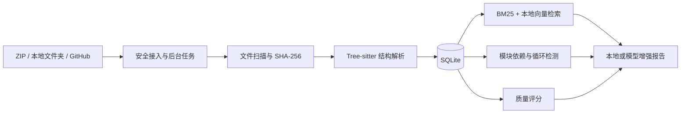

# DevAtlas

> 本地优先的代码仓库智能分析平台：从仓库导入、结构解析与代码搜索，到依赖图谱、质量检测和 Markdown 分析报告，全流程默认在本机完成。

[](https://github.com/Boomfreezing/DevAtlas/actions/workflows/ci.yml)


DevAtlas 面向需要快速理解陌生代码仓库的开发者。它可以导入 ZIP、本地文件夹或公开 GitHub 仓库，通过 Tree-sitter 提取 Python、TypeScript 和 JavaScript 的符号与依赖关系，并提供可解释、可复现的本地分析结果。结构分析、搜索、质量检测和规则报告无需模型或 API Key；智能问答必须先配置 Ollama 或在线生成模型，报告也可选择模型增强。支持 OpenAI、Claude、Gemini 及常见 Chat Completions 兼容服务。


## 项目亮点

| 能力 | 实现 |
|---|---|
| 多来源仓库接入 | ZIP、本地文件夹、公开 GitHub URL；后台任务展示阶段与进度；GitHub 项目支持保留项目 ID 的安全远程同步 |
| 代码结构解析 | Tree-sitter 提取函数、类、接口、方法、行号与导入关系；文件树每页 200 项读取，多目录共享文件行渲染预算、每树最多 4 个并发目录读取；符号、依赖、问题列表采用服务端分页，不执行被分析代码 |
| 本地代码搜索 | BM25 分页返回相关结果；智能问答额外使用本地向量语义检索与重排，可打开完整源码、定位命中行并高亮关键词 |
| 架构可视化 | 交互式 SVG 模块依赖图、路径筛选、节点出入度和循环依赖检测；支持 TS/JS 路径别名与 Python 常见源码根目录解析 |
| 修改影响分析 | 选择文件、类或函数后，区分模块导入与可核验的静态调用，聚合定义、依赖、二级影响、测试候选和接口/数据库路径线索；生成风险评分与 P1/P2/P3 修改验证清单 |
| 版本对比 | 快照保存结构、质量、依赖指标与分析口径；同口径比较问题变化，不同或未知口径不直接判定加分或修复；GitHub 项目可查看默认分支、HEAD 与最近提交，不复制仓库源码或 `.git` 历史 |
| 智能问答 | 可从任意项目功能页唤起的右侧工作区底部 Terminal；必须接入 Ollama 或已配置在线生成模型，源码回答强制展示文件路径和行号 |
| 质量检测 | 6 条确定性规则、生产/测试/生成代码分范围评分与加权综合分、按项目规模归一化的百分制评分和可执行修复建议 |
| 智能分析报告 | 本地规则引擎开箱即用；支持摘要/完整模式、生产与测试风险分布、重点风险模块聚合；可选本地或在线模型增强并导出 Markdown |
| 增量分析 | 元数据快路径 + SHA-256 内容确认，仅重新解析实际变化的文件 |
| 工程化交付 | SQLite 持久化、Docker Compose、Pytest/Vitest/Playwright、GitHub Actions CI |

## 可量化结果

| 指标 | 结果 |
|---|---:|
| 后端自动化测试 | 460 项（2026-09-12，含 22 项类型绑定边界、5 项验证脚本隔离，以及真实耦合探针工具、CommonJS/源码回退、静态绑定、引用校验、状态一致性与合成问答回归；SQLite 资源警告严格检查通过） |
| 后端测试覆盖率 | 86.92%（2026-09-12） |
| 前端自动化测试 | 340 项（2026-09-12，最终全量使用 2 个 worker，保持原断言与超时） |
| 浏览器回归测试 | Playwright 42 项：1 项真实隔离主流程 + 41 项模拟 API 的问答会话/错源保护、状态、后台同步、源码定位、图谱交互、长列表、质量筛选/分页重试、并发读取、焦点及缩放回归 |
| 中型仓库无变化增量分析 | 10.90 ms 中位数，较全量最高加速 **15.41×** |
| 大型仓库无变化增量分析 | 929 个文件、40,515 行，287.54 ms 中位数 |
| 大型仓库结构首屏 | 27,204 个符号、18,939 条依赖；摘要响应 0.13 KiB / 16.83 ms，较旧全量响应体减少 **99.99%** |
| 文件树目录读取 | 20,000 文件合成元数据样本：根目录 service P50 271.51 → 42.41 ms；宽目录首屏未压缩 JSON 2,192,950 → 33,903 bytes |

性能数据来自本地可复现脚本，完整环境、样本和适用边界见 [性能评测](./docs/PERFORMANCE.md)。

现阶段完成度、能力边界与后续验收建议见 [项目评估](./docs/PROJECT_REVIEW_2026-09-12.md)。

跨项目状态、缓存并发与快照比较口径，以及后续耦合分析、源码查看、文件树与搜索打磨见 [可靠性优化记录](./docs/STATE_CONSISTENCY.md)。

最新三档性能样本、深依赖图修复及页面拆分记录见 [第三阶段性能与维护性](./docs/WORKSPACE_PERFORMANCE.md)。

文件树的后端分页、9 场景前后对照、Python 分配峰值及小目录回退说明见 [文件树性能验收](./docs/FILE_TREE_PERFORMANCE.md)。此项是温热缓存下的服务查询测量，不是整个页面加载时间或进程 RSS。

后续浏览器打磨见 [长列表渲染与缓存回收](./docs/FILE_TREE_BROWSER_PERFORMANCE.md)：5,000 文件累计加载样本的挂载文件行从 5,000 降为视口附近 200 行，强制 GC 后 JS 堆约 46.75 → 9.25 MiB；限于本机合成宽目录，不代表进程 RSS 或所有目录结构。

最新[多目录验收](./docs/FILE_TREE_DENSE_PERFORMANCE.md)：同样展开 24 个目录、读取 2,400 文件时，挂载文件行从 2,400 → 200，强制 GC 后 JS 堆中位 29.40 → 10.65 MiB。600 个纯目录没有 DOM 回收收益，快速项目切换前后耗时相近；本机各 3 次样本不代表所有仓库或设备。

后续[依赖图谱验收](./docs/DEPENDENCY_GRAPH_PERFORMANCE.md)覆盖请求取消、循环聚焦、互逆边/自环、键盘及分组绘制。400 节点/2,000 边样本的节点选择中位 266.30 → 68.42 ms；首次聚焦 256.81 → 387.64 ms、聚焦态 JS 堆 19.25 → 21.20 MiB，仍有回退，不能概括为全面加速或节省内存。

最新[图谱生产构建验收](./docs/DEPENDENCY_GRAPH_PRODUCTION.md)在同生产环境下精简文本节点：400 节点/2,000 边首次聚焦中位 172.51 → 154.97 ms，强制 GC 后 JS 堆 11.70 → 8.94 MiB，节点和边完整保留。清空筛选总耗时改善很小，缩小计时仍有回退；生产数据不与上段开发模式混算。

真实仓库问答评测、60 道题与语义检索对照见 [真实源码验收](./docs/QA_REAL_EVALUATION.md)；最新[离线检索复测](./docs/QA_RECHECK.md)中，结构组从 40/60 提升到 44/60，完整重排组从 40/60 提升到 47/60，必要证据 Recall@5 为 66.01%→77.45%。仍有失败题和个别证据排序回退；检索命中不代表生成回答准确率，真实模型回答仍待授权验收与人工复核。

最新[质量检测打磨](./docs/QUALITY_WORKSPACE.md)统一筛选与分页状态，并完成后续同步缓存更新、解析覆盖可信度和窄屏重排。规则基础权重不变；评分输入不再将有解析问题或超解析限制的文件计作可用依据，历史快照不补造新口径。原长列表性能数字保留为上一实现时点的基线。

前期[耦合分析证据修正](./docs/COUPLING_EVIDENCE.md)区分同名符号、导入别名和作用域遮蔽，排除注释/字符串伪调用；测试关联只提供有限的风险参考，不再表示为实际测试覆盖率。分析按需读取有界索引，缺行时仅回退到通过版本校验的原文，不恢复全仓库函数调用图。

后续[真实源码定向抽查](./docs/COUPLING_REAL_EVALUATION.md)复用 Flask、Requests、Express 固定源码与 24 条先验标注：应确认关系从 9/15 提升至 15/15，9 条不应确认关系仍全部正确排除。索引缺行时仅补读路径安全、哈希与已分析版本一致的有界原文。样本用于诊断与修复回归，不代表整个调用图的准确率；风险权重不变。

本轮[推送前检查](./docs/PRE_PUSH_CHECK.md)进一步排除 TypeScript 类型导入/导出的运行时调用误报，保留正常值绑定；同时隔离完整验证环境并整理文档与公开文件，24 条固定探针再次全部通过。

## 工作流程



系统设计、分析时序与关键取舍见 [架构文档](./docs/ARCHITECTURE.md)。

## 界面预览

| 依赖图谱 | 质量检测 |
|---|---|
|  |  |

| BM25 代码搜索 | 分析报告 |
|---|---|
|  |  |

更多界面包括 [API 配置](./docs/assets/devatlas-provider-config.png) 和 [移动端布局](./docs/assets/devatlas-mobile.png)。

## 快速开始

### 环境要求

- Python 3.11+（CI 使用 3.13）
- Node.js 20.19+ 或 22.12+（CI 使用 24）
- npm
- 可选：Docker Desktop、Ollama

### 本地开发

1. 克隆项目并进入目录：

```bash
git clone https://github.com/Boomfreezing/DevAtlas.git
cd DevAtlas
```

2. 启动后端：

```powershell
cd backend
python -m venv .venv
.\.venv\Scripts\Activate.ps1
python -m pip install -e ".[dev]"
python -m uvicorn app.main:app --reload
```

3. 在另一个终端启动前端：

```powershell
cd frontend
npm install
npm run dev
```

打开：

- Web：<http://localhost:5173>
- API：<http://localhost:8000>
- Swagger：<http://localhost:8000/docs>

后端从仓库根目录读取可选的 `.env`。如需覆盖默认配置，先将 `.env.example` 复制为 `.env`。

### Docker Compose

```bash
docker compose up --build
```

访问 <http://localhost:8080>。数据库、导入仓库和报告配置统一保存在根目录 `data/`，且不会进入版本控制。

## 报告接口与成本

| 接口 | 默认状态 | 成本与说明 |
|---|---|---|
| DevAtlas 本地规则引擎 | 仅用于分析报告 | 免费、无需模型、API Key 或网络请求，不提供智能问答 |
| Ollama 本地模型服务 | 配置后启用 | 模型在本机或局域网运行，需先安装并下载模型 |
| OpenAI Responses API | 配置后启用 | 按供应商计费；支持 OpenAI 官方或实现 Responses 协议的兼容网关 |
| Chat Completions 兼容接口 | 配置后启用 | 支持 DeepSeek、通义千问、Moonshot、硅基流动、OpenRouter 等兼容服务 |
| Anthropic Messages API | 配置后启用 | 支持 Claude 官方 API |
| Google Gemini API | 配置后启用 | 支持 Gemini GenerateContent API |

服务地址、模型和认证信息统一在独立的“API 配置”菜单中配置并测试；该菜单不依赖已选择的仓库，并可分别指定分析报告和智能问答的默认模型。配置保存在 `data/report-providers.json`：API Key 不通过查询接口回传、不写入前端代码，也不提交到 Git。

## 质量评分设计

- 仓库文件先统一划分为生产代码、测试代码和生成/外部代码；三项默认按 70%、20%、10% 计算综合分，并分别展示评分与风险数量。
- 某类代码不存在或没有可用结构解析依据时显示 N/A，不按 100 分处理，也不参与综合分；其默认权重按比例分配给具备评分依据的代码范围。
- 覆盖率依据已保存的解析问题、支持类型和文件大小限制估算，排除语法错误、读取失败和超限跳过的文件；合法空文件或常量文件不因零符号被误判失败。这不是运行时测试覆盖率，也不能证明历史索引完整性。
- 评分输入口径与覆盖口径随快照保存；覆盖不足的快照不评级，旧/新计算口径不同不直接判断质量提升。历史记录不被改写。
- 高风险、中风险、低风险项的基础扣分权重分别为 8、3、1；API 内部仍使用 `error`、`warning`、`info` 作为稳定枚举值。
- 参考规模为 50 个文件、10,000 行代码或 500 个符号；超过任一参考值后，单项扣分按规模单位线性递减，使问题数量与项目规模同比增长时总扣分趋于稳定。
- 只要存在规则命中，最终至少扣 1 分；高风险项权重也始终高于中风险和低风险项。
- 同一检测规则最多扣 20 分，避免大量同类问题完全掩盖其他质量维度。
- 质量接口与导出的分析报告保留基础扣分、校准后扣分、规模系数和当前实际权重，便于需要时复核评分；质量检测页面仅展示最终评分与问题结果。

## 依赖分类可信度

- 已成功解析到仓库文件的关系记为项目内导入，并进入依赖图、入度/出度与循环依赖计算。
- TypeScript / JavaScript 会读取仓库内适用的 `tsconfig.json` 或 `jsconfig.json`，支持 `baseUrl`、`paths` 通配符和精确别名；JSONC 注释与尾逗号不会阻断配置读取。
- Python 除标准包路径和相对导入外，还会识别 `src/`、`backend/`、`server/`、`python/` 等常见源码根目录下的绝对包导入。
- 未解析关系会保守分类为“推定外部”或“待确认”；相对路径、与仓库顶层模块同名但未定位成功的导入属于待确认，不会被误报为外部依赖。
- 可信度按“已分类导入 / 全部导入”计算。页面和 Markdown 报告同时展示待确认数量，方便判断依赖分析是否需要补充别名解析能力。

## 智能问答

- “智能问答”是右侧工作区下方的独立 Terminal 面板，与主内容卡片分离且不占用左侧功能菜单；支持按钮或 `Ctrl+J` 唤起和关闭。
- 界面采用项目统一的黑底绿色 Terminal 风格，问题直接在命令提示符后输入，不显示独立输入框；每条证据路径可直接打开只读源码查看器并定位对应行。
- 回答前使用本地混合证据引擎：联合 BM25 内容检索、向量语义检索、符号精确匹配、关键配置直读与有界依赖追踪，再按语义相似度、问题意图、路径、符号命中和证据多样性重排结果。代码块会额外标注接口、数据库、配置、异常、认证和缓存等检索概念；大型仓库的向量索引优先覆盖更多生产文件，避免索引只集中在仓库前半部分。
- 索引优先按函数、方法、类和接口分块，单块控制在 80 行并保留少量定义上下文；普通模块使用重叠窗口，避免把大型文件整体交给模型。
- 本地检索支持中文字符二元词、代码概念别名、函数/类名近似匹配和多意图问题拆分；检索结果必须交给已配置的 Ollama 或在线生成模型组织成最终回答。
- 向量层使用本机 ONNX 嵌入模型；首次问答只对有限候选做语义重排，完整项目索引在响应后后台预热并持久化，避免大型仓库阻塞导入或首次回答。模型缓存和索引默认位于项目的 `data/models/` 与 `data/indexes/semantic/`，不会写入系统临时目录。
- 证据重排默认提升生产代码和精确符号定义，降低测试代码权重并强烈抑制 `vendor`、`dist`、压缩文件等生成/第三方代码；询问测试或修改影响时才恢复测试证据权重。
- 未配置生成模型时 Terminal 会锁定输入并引导进入“API 配置”；后端同时拒绝 `local` 问答请求，避免绕过界面退回固定模板。
- 问候、`/help` 和当前项目名称等会话问题由项目上下文路由直接回答，不再触发无关源码检索；常规源码定位问题也会优先展示精确定义与相关引用。
- 连续追问会继承上一问题以及上一回答中的函数、类和文件路径；“它的调用者”“相关测试呢”等短问题不再丢失当前分析对象。
- 每次回答独立返回证据列表，包含文件 ID、仓库相对路径、准确起止行号、证据类型、符号名和源码片段；返回前重新验证项目归属、真实文件和行号，并清理模型生成的无效引用编号。弱相关证据不会进入模型；没有足够证据或模型没有给出有效引用时，系统会明确拒绝展示未经验证的结论。
- Terminal 在每次回答后显示“证据已校验 / 证据不足 / 引用校验失败”、置信度、证据数、有效引用数与耗时，帮助用户快速判断答案是否值得继续采用。
- 模型调用失败后保留原问题，用户可在 Terminal 顶部切换模型并使用“当前模型重试”，无需重新输入。
- 关闭重开同一项目的问答面板保留对话和草稿；追问只携带当前分析版本的成功完整轮次。生成结束及打开引用时重新核验源码，避免旧回答或文件 ID 复用指向错误代码。停止等待不保证模型服务停止计算，重试始终由用户触发；能力边界见[问答一致性记录](./docs/STATE_CONSISTENCY.md#14-问答上下文与引用一致性)。
- 报告与问答复用“API 配置”菜单中的同一套安全配置，但本地规则引擎只服务于报告。问答仅将检索到的片段和最近会话上下文发送给所选生成模型。

## 增量分析设计

1. 比较文件大小与纳秒级修改时间，快速跳过确定未变化的文件。
2. 元数据发生变化时计算 SHA-256，区分时间戳变化与内容变化。
3. 仅对新增或内容变化的源文件重新执行 Tree-sitter 解析。
4. 删除文件时同步清理符号、依赖、解析问题和搜索片段。
5. 内容实际变化后刷新依赖解析与 BM25 索引。

搜索与智能问答使用的运行时 BM25 结构会在导入或重分析阶段预先构建，并以压缩 JSON 保存到 `data/indexes/`。智能问答的本地向量索引按需后台构建，最多索引 5,000 个代码块；后端重启后优先恢复磁盘索引。目录可通过 `DEVATLAS_SEARCH_INDEX_ROOT` 指向其他非系统盘位置，模型缓存自动放在该目录同级的 `models/`，删除项目时会同步清理两类项目索引。

## 修改影响分析

- “耦合分析”可从左侧菜单打开，也可从仓库文件树、符号列表和代码搜索结果直接进入。
- 分析结果会把相关测试、直接调用者、接口契约、数据契约、循环依赖和间接模块整理为 P1/P2/P3 行动清单，并关联需要检查的文件；最后提醒重新分析并通过快照验证变化。
- 文件级调用者、被依赖对象和循环依赖来自已经解析成功的项目内导入关系，标记为高置信。
- 类、函数和方法级直接调用者需通过调用语法、导入绑定和作用域核验；文件级依赖及二级模块影响单独保留。源码不全、动态调用等情况保守降级或省略，不冒充完整运行时调用图。
- 风险等级综合静态调用者、模块依赖、二级影响、循环依赖、接口/数据库路径线索与静态测试关联；只有可核验的目标测试调用获得有限减分，不代表测试通过或实际测试覆盖率。
- 所有影响项都可打开源码并定位行号；未发现相关项时明确显示“未发现”，不填充推测结果。

## 分析结果缓存

- 模块依赖图与质量检测分别缓存项目级基础分析快照，循环聚焦、规则筛选和分页只执行轻量切片，不重复扫描全部分析记录。
- 缓存按数据库、项目和分析类型隔离，使用线程安全的进程内有界 LRU，最多保留每个数据库最近使用的 16 个项目。
- 全量分析、发生文件增删改的增量分析和项目删除会统一失效；无内容变化的增量分析保留有效缓存。
- 缓存只保存可重建的分析结果，不写入磁盘，不改变 API 响应结构，也不会额外占用仓库所在目录之外的空间。

## 分析快照与对比

- 首次导入、全量分析和发生真实文件变化的增量分析会自动保存快照，也可在“版本对比”菜单手动命名保存。
- 快照持久化保存综合质量分、文件/符号/导入数量、质量问题定位、解析问题和循环依赖，不保存源码正文。
- 任意选择两个快照后，可查看指标差值以及新增、已修复、持续存在的问题；每组明细最多展示 100 条并明确标记截断。
- 每个项目最多保留最近 30 个快照，删除项目时由数据库级联清理。
- GitHub 项目在导入时尽力读取默认分支、HEAD 和最近 20 条提交；也可在版本对比页同步远端版本，并选择其中两个提交查看远端提交数量、增删行与变更文件。
- “同步远程仓库”先比较远端 HEAD；无新提交时只更新提交记录，有变化时将新源码下载到独立目录完成安全校验和全量分析，成功后才切换原项目并创建 `REMOTE_SYNC` 快照。项目 ID 和既有快照保留，失败不会覆盖当前可用源码。
- 同步以本地成功分析的 `source_commit` 为比较基线；刷新远端提交记录不会改变该基线。可获取元数据时按完整 Commit SHA 下载源码，报告分别显示源码版本与远端记录。旧项目首次启动后保持版本未知，下一次主动同步时建立可信绑定。

## 测试与验证

从仓库根目录执行完整验证：

```powershell
.\scripts\verify_project.ps1
```

脚本串联文档链接、Ruff、严格资源警告与覆盖率检查、36 道合成检索题、前端单测/构建及浏览器回归。运行环境隔离在项目内 `data/tmp/verification/run-*`：使用独立数据库、仓库目录、索引和空模型配置，关闭语义模型联网；成功或失败后均恢复当前进程原有环境变量。不会下载真实语料或调用生成模型，依赖须预先安装。

以下是各检查的单独命令（在已配置隔离环境中运行）；日常使用优先选择上方完整脚本：

```powershell
# 后端测试与覆盖率
cd backend
python -m ruff check app tests evaluations
python -W error::ResourceWarning -m pytest --cov=app --cov-fail-under=85 -W error::ResourceWarning -W error::pytest.PytestUnraisableExceptionWarning
python -m evaluations.repository_qa

# 前端单元测试、构建和端到端测试
cd ..\frontend
npm.cmd test -- --maxWorkers=2
npm.cmd run build
npm.cmd run test:e2e
```

以上为 Windows 命令，其他平台将 `npm.cmd` 换为 `npm`。CI 在每次 `push` 和 Pull Request 时分别执行 Ruff 后端静态检查、后端测试、离线合成证据回归、前端测试与 e2e 流程；浏览器失败时保留 7 天追踪产物。Playwright 测试覆盖从本地文件夹导入，到报告生成、Markdown 下载、BM25 搜索和无变化增量分析的核心用户路径。

智能问答的离线评测共用实际检索链路，包含 3 个合成源码样例和 36 道题。默认不调用模型、不访问日常仓库；结果保存在 `data/tmp/qa-eval/run-*`。它衡量检索与引用，不代表大模型回答准确率，详见 [评测说明](./docs/QA_EVALUATION.md)。

端到端测试使用独立的 `8011/5175` 端口，不复用日常开发服务、已有项目或 API 配置。单独运行使用 `data/tmp/e2e/run-*`，通过完整脚本运行则使用本次隔离目录下的 `e2e/`；测试目录保留在项目所在磁盘，便于失败后排查。

重新生成 README 截图：

```bash
cd frontend
npm run capture:assets
```

截图任务使用 8010/5174 端口的隔离环境，不读取或修改日常项目数据库。

## API 概览

| 方法 | 路径 | 用途 |
|---|---|---|
| `GET` | `/api/health` | 健康检查 |
| `GET / POST` | `/api/projects` | 获取项目 / 上传 ZIP 并分析 |
| `POST` | `/api/projects/folder` | 导入本地文件夹 |
| `POST` | `/api/projects/github` | 下载公开 GitHub 仓库 |
| `GET` | `/api/projects/jobs/{job_id}` | 查询后台任务阶段和进度 |
| `GET` | `/api/projects/{id}` | 获取项目摘要，不加载完整文件清单 |
| `GET` | `/api/projects/{id}/files/tree` | 按目录读取文件树下一层，支持 `path` 参数 |
| `GET` | `/api/projects/{id}/structure` | 兼容接口：获取完整符号、依赖和解析问题 |
| `GET` | `/api/projects/{id}/structure/summary` | 获取结构统计摘要，不加载明细行 |
| `GET` | `/api/projects/{id}/symbols` | 分页获取符号，支持 `limit`、`offset`、`q` 和 `kind` |
| `GET` | `/api/projects/{id}/imports` | 分页获取导入关系，支持 `limit`、`offset`、`q` 和 `scope` |
| `GET` | `/api/projects/{id}/issues` | 分页获取解析问题，支持 `limit` / `offset` |
| `GET` | `/api/projects/{id}/search` | BM25 项目内搜索，支持 `limit` / `offset` 分页 |
| `GET` | `/api/projects/{id}/files/{file_id}/content` | 安全读取项目内文本源码，供代码查看器使用 |
| `GET` | `/api/projects/{id}/dependency-graph` | 依赖图与循环依赖；支持通过 `cycle` 按需加载某个完整依赖环 |
| `GET` | `/api/projects/{id}/impact-targets` | 按路径或符号名搜索影响分析对象 |
| `GET` | `/api/projects/{id}/impact` | 返回文件或符号的有界修改影响报告 |
| `GET / POST` | `/api/projects/{id}/snapshots` | 列出或保存分析快照 |
| `GET` | `/api/projects/{id}/snapshots/compare` | 通过 `base_id` 和 `target_id` 对比两个快照 |
| `DELETE` | `/api/projects/{id}/snapshots/{snapshot_id}` | 删除一个分析快照 |
| `GET` | `/api/projects/{id}/git-summary` | 读取已保存的 GitHub 默认分支、HEAD 与最近提交 |
| `POST` | `/api/projects/{id}/git-summary/refresh` | 从 GitHub 刷新项目提交元数据 |
| `GET` | `/api/projects/{id}/git-compare` | 使用完整 `base` / `head` SHA 对比两个 GitHub 提交 |
| `POST` | `/api/projects/{id}/sync-github` | 后台检查并安全同步 GitHub 最新源码，保留项目 ID 与历史快照 |
| `POST` | `/api/projects/{id}/ask` | 基于仓库证据回答问题，返回文件路径、行号、源码片段和问答引擎信息 |
| `GET` | `/api/projects/{id}/quality` | 三类代码的加权综合质量分与分范围统计，明细支持 `limit`、`offset`、`severity`、`rule` 和 `scope` |
| `GET` | `/api/projects/{id}/report` | 生成可预览分析报告，支持 `mode=summary/full` |
| `GET` | `/api/projects/{id}/report.md` | 下载 Markdown 报告，支持 `mode=summary/full` |
| `POST` | `/api/projects/{id}/incremental-reanalyze` | 增量重新分析 |

完整交互式接口定义可在后端启动后访问 `/docs`。

## 仓库结构

```text
DevAtlas/
├─ backend/                 FastAPI、SQLAlchemy、Tree-sitter 与 Pytest
├─ frontend/                React、TypeScript、Vitest 与 Playwright
├─ benchmarks/              固定合成源码、问答标注及评测对比
├─ docs/                    架构、性能、演示、发布清单与截图
│  └─ assets/               README 使用的可复现界面截图
├─ scripts/                 完整验证与性能评测脚本
├─ data/                    SQLite、导入仓库和模型配置（运行时数据）
├─ .github/workflows/       GitHub Actions CI
├─ .env.example             无敏感信息的配置模板
└─ docker-compose.yml       容器化启动配置
```

## 文档

- [文档导航](./docs/README.md)
- [系统架构](./docs/ARCHITECTURE.md)
- [项目推进计划](./docs/PROJECT_PLAN.md)
- [性能评测](./docs/PERFORMANCE.md)
- [智能问答评测](./docs/QA_EVALUATION.md)
- [2～3 分钟演示脚本](./docs/DEMO_SCRIPT.md)
- [发布与简历交付清单](./docs/DELIVERY.md)

## 安全边界

- ZIP 解压前检查绝对路径、`..` 路径穿越、符号链接、加密条目、重复路径、条目数量与展开体积；默认上传上限 200 MB、文件夹上限 20000 个文件，单个源码文件上限 5 MB，均可通过环境变量配置。
- 本地文件夹支持点击式安全目录 API，以及兼容内置浏览器的文件夹拖放惰性遍历；两种入口都会在进入前跳过依赖和构建目录，并通过扫描条目、目录深度、文件数和体积熔断避免超大目录拖垮页面。
- GitHub 导入限制仓库根地址、重定向、超时与下载大小，只下载默认分支，不执行仓库代码；下载后的 ZIP 与本地文件夹采用一致的扩展名、依赖目录、文件数量、单文件和总大小过滤策略。
- ZIP 上传与 GitHub 下载的临时文件统一写入项目内的 `data/tmp/`，不会使用 Windows 默认的 C 盘临时目录；可通过 `DEVATLAS_TEMPORARY_ROOT` 指向其他非系统盘路径。
- 默认忽略 `.git`、`node_modules`、`dist`、`build` 等目录，只扫描已知文本和源代码扩展名。
- SQLite、导入仓库、API Key、生成报告、依赖与测试产物均通过 `.gitignore` 排除。
- 默认分析完全在本地运行；只有主动选择并配置在线模型时才会发起模型请求。

不建议将尚未审查、包含高度敏感信息的仓库交给公开部署的 DevAtlas 实例分析。

## Roadmap

- [x] 仓库多来源导入与后台任务
- [x] Tree-sitter 结构解析、BM25 搜索、依赖图与质量检测
- [x] 增量分析、Markdown 报告和可选模型增强
- [x] Docker Compose 与 GitHub Actions CI
- [x] 本地向量搜索、候选语义重排与 BM25 混合检索
- [ ] 增加更多语言解析器和报告协议适配器
- [x] `v0.8.0` 首个简历展示预发布版本
- [x] `v0.8.1` 搜索结果分页、明确展示计数与加载更多
- [x] `v0.9.0` 源码查看器、命中定位与关键词高亮
- [x] 基于源码并强制附文件路径与行号的智能问答终端
- [x] 文件、类和函数级修改影响分析闭环
- [x] GitHub 默认分支、HEAD 与最近提交元数据
- [x] 最近提交差异、变更文件与增删行分析
- [ ] 任意分支对比、长期热点文件与共同变更分析
- [x] 分析快照与两次分析结果对比
- [ ] 可导出的团队自定义分析规则
- [ ] 新人了解、Bug 定位、代码评审、重构、文档与面试讲解预设模式
- [ ] 2～3 分钟演示视频
