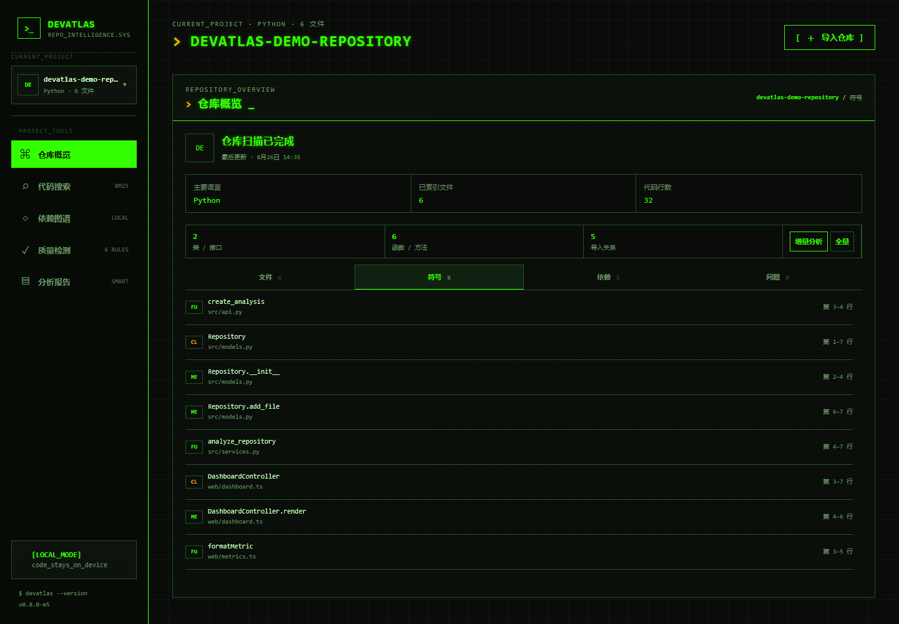
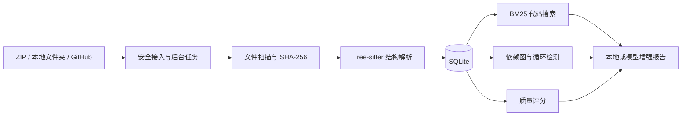
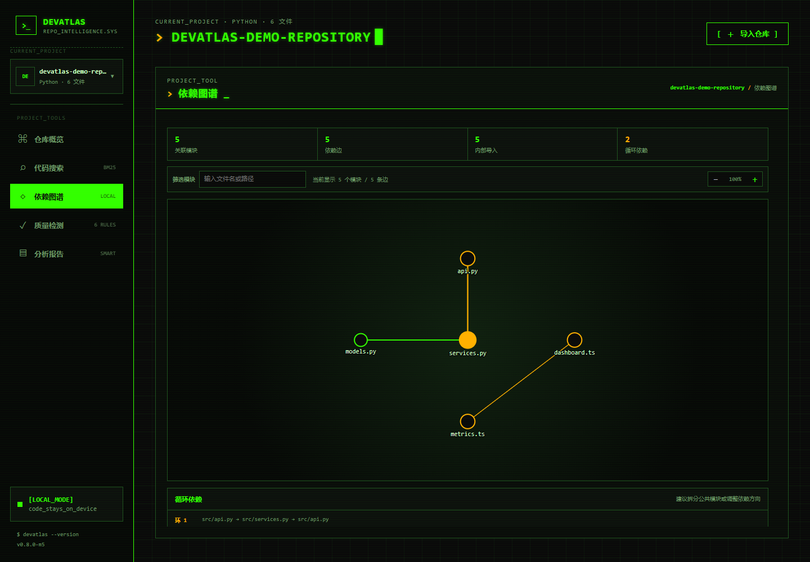
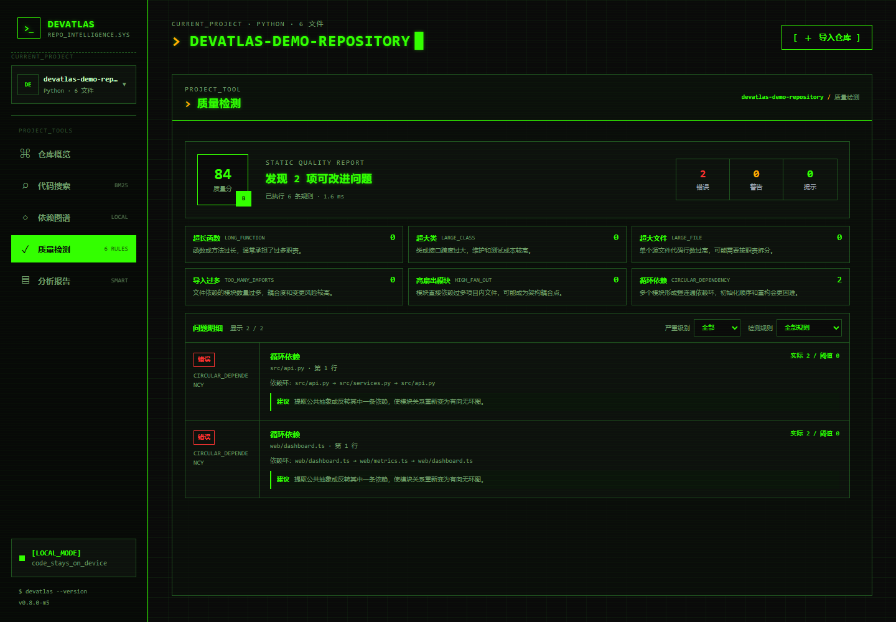
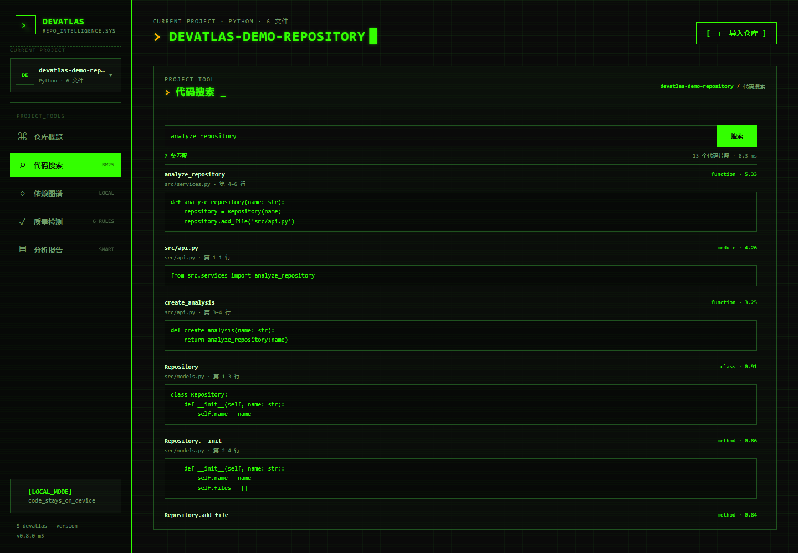
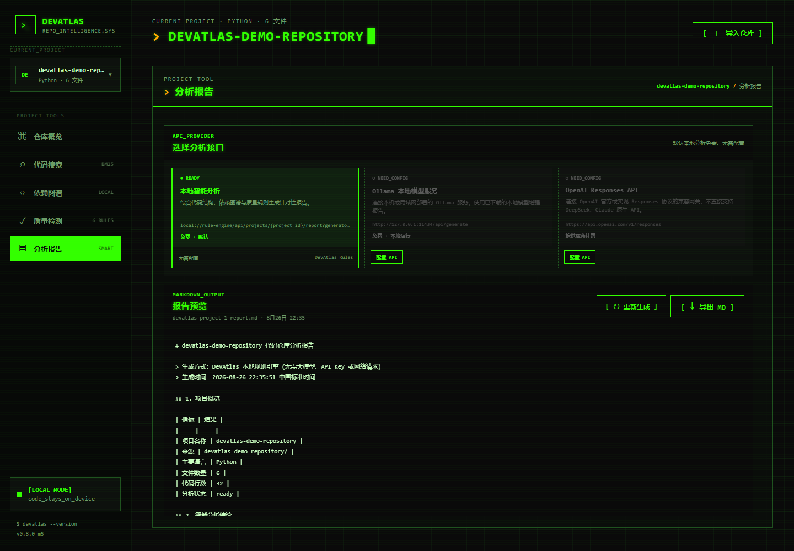

# DevAtlas

> 本地优先的代码仓库智能分析平台：从仓库导入、结构解析与代码搜索，到依赖图谱、质量检测和 Markdown 分析报告，全流程默认在本机完成。

[](https://github.com/Boomfreezing/DevAtlas/actions/workflows/ci.yml)


DevAtlas 面向需要快速理解陌生代码仓库的开发者。它可以导入 ZIP、本地文件夹或公开 GitHub 仓库，通过 Tree-sitter 提取 Python、TypeScript 和 JavaScript 的符号与依赖关系，并提供可解释、可复现的本地分析结果。默认模式无需 API Key；需要更深入的报告时，可选接入 Ollama 或 OpenAI Responses API。



## 项目亮点

| 能力 | 实现 |
|---|---|
| 多来源仓库接入 | ZIP、本地文件夹、公开 GitHub URL；后台任务展示阶段与进度 |
| 代码结构解析 | Tree-sitter 提取函数、类、接口、方法、行号与导入关系，不执行被分析代码 |
| 本地代码搜索 | BM25 分页返回相关结果；可打开完整源码、定位命中行并高亮关键词 |
| 架构可视化 | 交互式 SVG 依赖图、路径筛选、节点出入度和循环依赖检测 |
| 质量检测 | 6 条确定性规则、百分制评分、严重级别筛选和可执行修复建议 |
| 智能分析报告 | 本地规则引擎开箱即用；可选 Ollama / OpenAI Responses 增强；支持预览与导出 Markdown |
| 增量分析 | 元数据快路径 + SHA-256 内容确认，仅重新解析实际变化的文件 |
| 工程化交付 | SQLite 持久化、Docker Compose、Pytest/Vitest/Playwright、GitHub Actions CI |

## 可量化结果

| 指标 | 结果 |
|---|---:|
| 后端自动化测试 | 32 项 |
| 后端测试覆盖率 | 85.78% |
| 前端自动化测试 | 8 项 |
| 主流程端到端测试 | Playwright 1 项，覆盖导入、报告、搜索与增量分析 |
| 中型仓库无变化增量分析 | 10.90 ms 中位数，较全量最高加速 **15.41×** |
| 大型仓库无变化增量分析 | 929 个文件、40,515 行，287.54 ms 中位数 |

性能数据来自本地可复现脚本，完整环境、样本和适用边界见 [性能评测](./docs/PERFORMANCE.md)。

## 工作流程



系统设计、分析时序与关键取舍见 [架构文档](./docs/ARCHITECTURE.md)。

## 界面预览

| 依赖图谱 | 质量检测 |
|---|---|
|  |  |

| BM25 代码搜索 | 分析报告 |
|---|---|
|  |  |

更多界面包括 [API 配置](./docs/assets/devatlas-provider-config.png) 和 [移动端布局](./docs/assets/devatlas-mobile.png)。

## 快速开始

### 环境要求

- Python 3.11+（CI 使用 3.13）
- Node.js 20.19+ 或 22.12+（CI 使用 24）
- npm
- 可选：Docker Desktop、Ollama

### 本地开发

1. 克隆项目并进入目录：

```bash
git clone https://github.com/Boomfreezing/DevAtlas.git
cd DevAtlas
```

2. 启动后端：

```powershell
cd backend
python -m venv .venv
.\.venv\Scripts\Activate.ps1
python -m pip install -e ".[dev]"
python -m uvicorn app.main:app --reload
```

3. 在另一个终端启动前端：

```powershell
cd frontend
npm install
npm run dev
```

打开：

- Web：<http://localhost:5173>
- API：<http://localhost:8000>
- Swagger：<http://localhost:8000/docs>

后端从仓库根目录读取可选的 `.env`。如需覆盖默认配置，先将 `.env.example` 复制为 `.env`。

### Docker Compose

```bash
docker compose up --build
```

访问 <http://localhost:8080>。数据库、导入仓库和报告配置统一保存在根目录 `data/`，且不会进入版本控制。

## 报告接口与成本

| 接口 | 默认状态 | 成本与说明 |
|---|---|---|
| DevAtlas 本地规则引擎 | 可直接使用 | 免费、无需模型、API Key 或网络请求 |
| Ollama 本地模型服务 | 配置后启用 | 模型在本机或局域网运行，需先安装并下载模型 |
| OpenAI Responses API | 配置后启用 | 按供应商计费；支持 OpenAI 官方或实现 Responses 协议的兼容网关 |

OpenAI Responses 入口不直接兼容 DeepSeek、Claude 等供应商的原生协议；接入这些原生 API 需要增加 Chat Completions 或 Anthropic Messages 适配器。

服务地址、模型和认证信息可直接在“分析报告”页面配置并测试。配置保存在 `data/report-providers.json`：API Key 不通过查询接口回传、不写入前端代码，也不提交到 Git。

## 增量分析设计

1. 比较文件大小与纳秒级修改时间，快速跳过确定未变化的文件。
2. 元数据发生变化时计算 SHA-256，区分时间戳变化与内容变化。
3. 仅对新增或内容变化的源文件重新执行 Tree-sitter 解析。
4. 删除文件时同步清理符号、依赖、解析问题和搜索片段。
5. 内容实际变化后刷新依赖解析与 BM25 索引。

## 测试与验证

从仓库根目录执行完整验证：

```powershell
.\scripts\verify_project.ps1
```

或分别运行：

```powershell
# 后端测试与覆盖率
cd backend
python -m pytest --cov=app --cov-fail-under=85

# 前端单元测试、构建和端到端测试
cd ..\frontend
npm test
npm run build
npm run test:e2e
```

CI 在每次 `push` 和 Pull Request 时分别执行后端、前端与 e2e 三组任务。Playwright 测试覆盖从本地文件夹导入，到报告生成、Markdown 下载、BM25 搜索和无变化增量分析的核心用户路径。

重新生成 README 截图：

```bash
cd frontend
npm run capture:assets
```

截图任务使用 8010/5174 端口的隔离环境，不读取或修改日常项目数据库。

## API 概览

| 方法 | 路径 | 用途 |
|---|---|---|
| `GET` | `/api/health` | 健康检查 |
| `GET / POST` | `/api/projects` | 获取项目 / 上传 ZIP 并分析 |
| `POST` | `/api/projects/folder` | 导入本地文件夹 |
| `POST` | `/api/projects/github` | 下载公开 GitHub 仓库 |
| `GET` | `/api/projects/jobs/{job_id}` | 查询后台任务阶段和进度 |
| `GET` | `/api/projects/{id}/structure` | 获取符号、依赖和解析问题 |
| `GET` | `/api/projects/{id}/search` | BM25 项目内搜索，支持 `limit` / `offset` 分页 |
| `GET` | `/api/projects/{id}/files/{file_id}/content` | 安全读取项目内文本源码，供代码查看器使用 |
| `GET` | `/api/projects/{id}/dependency-graph` | 依赖图与循环依赖 |
| `GET` | `/api/projects/{id}/quality` | 质量评分与修复建议 |
| `GET` | `/api/projects/{id}/report` | 生成可预览分析报告 |
| `GET` | `/api/projects/{id}/report.md` | 下载 Markdown 报告 |
| `POST` | `/api/projects/{id}/incremental-reanalyze` | 增量重新分析 |

完整交互式接口定义可在后端启动后访问 `/docs`。

## 仓库结构

```text
DevAtlas/
├─ backend/                 FastAPI、SQLAlchemy、Tree-sitter 与 Pytest
├─ frontend/                React、TypeScript、Vitest 与 Playwright
├─ docs/                    架构、性能、演示、发布清单与截图
│  └─ assets/               README 使用的可复现界面截图
├─ scripts/                 完整验证与性能评测脚本
├─ data/                    SQLite、导入仓库和模型配置（运行时数据）
├─ .github/workflows/       GitHub Actions CI
├─ .env.example             无敏感信息的配置模板
└─ docker-compose.yml       容器化启动配置
```

## 文档

- [文档导航](./docs/README.md)
- [系统架构](./docs/ARCHITECTURE.md)
- [项目推进计划](./docs/PROJECT_PLAN.md)
- [性能评测](./docs/PERFORMANCE.md)
- [2～3 分钟演示脚本](./docs/DEMO_SCRIPT.md)
- [发布与简历交付清单](./docs/DELIVERY.md)

## 安全边界

- ZIP 解压前检查绝对路径与 `..` 路径穿越，默认上传上限 50 MB。
- GitHub 导入限制仓库根地址、重定向、超时与下载大小，只下载默认分支，不执行仓库代码。
- 默认忽略 `.git`、`node_modules`、`dist`、`build` 等目录，只扫描已知文本和源代码扩展名。
- SQLite、导入仓库、API Key、生成报告、依赖与测试产物均通过 `.gitignore` 排除。
- 默认分析完全在本地运行；只有主动选择并配置在线模型时才会发起模型请求。

不建议将尚未审查、包含高度敏感信息的仓库交给公开部署的 DevAtlas 实例分析。

## Roadmap

- [x] 仓库多来源导入与后台任务
- [x] Tree-sitter 结构解析、BM25 搜索、依赖图与质量检测
- [x] 增量分析、Markdown 报告和可选模型增强
- [x] Docker Compose 与 GitHub Actions CI
- [ ] 本地向量搜索与混合检索
- [ ] 增加更多语言解析器和报告协议适配器
- [x] `v0.8.0` 首个简历展示预发布版本
- [x] `v0.8.1` 搜索结果分页、明确展示计数与加载更多
- [x] `v0.9.0` 源码查看器、命中定位与关键词高亮
- [ ] 2～3 分钟演示视频
