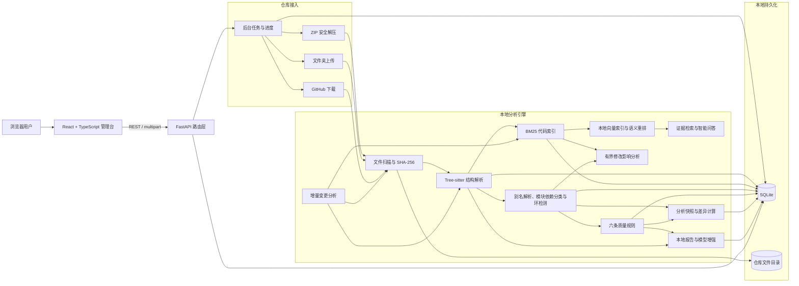
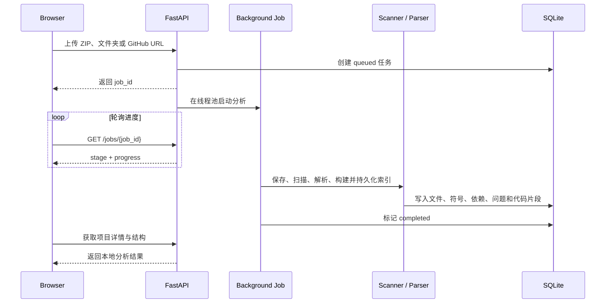

# DevAtlas 系统架构

## 总体架构

可选模型增强通过统一 Provider 层接入 Ollama、OpenAI Responses、OpenAI 风格 Chat Completions、Anthropic Messages 与 Gemini GenerateContent。默认本地分析不依赖外部模型；模型服务地址和认证配置保存在根目录 `data/` 中，不进入版本控制。

## 导入与分析时序

## 增量分析策略

1. 先比较文件大小和纳秒级修改时间，快速跳过确定未变化的文件。
2. 元数据变化时计算 SHA-256，区分“时间戳变化”和“内容变化”。
3. 仅对新增和内容变化的源文件执行 Tree-sitter 解析。
4. 删除文件时同步清理符号、导入关系、解析问题和搜索片段。
5. 内容确实变化后刷新导入解析和 BM25 索引；无变化时返回 207 B 左右的轻量摘要。

BM25 运行时索引采用带格式版本、项目存储标识和数据库签名的压缩 JSON 快照，默认写入 `data/indexes/`。查询顺序为内存缓存、磁盘快照、数据库代码块重建；快照损坏、版本过期或签名不匹配时自动回退重建并原子替换文件。删除项目时同步删除磁盘快照，索引文件不进入 Git。

## 源码查看器安全边界

1. API 同时校验项目 ID 与文件 ID，文件必须属于当前项目。
2. 解析后的绝对路径必须位于项目仓库根目录内，阻止 `..` 和符号链接越界。
3. 仅展示不含空字节的文本文件，并将单文件大小限制为 2 MB。
4. 接口只读，不执行、修改或向模型服务发送仓库源码。

## 智能问答证据边界

智能问答先结合最近会话补全指代，并从上一回答提取函数、类和文件路径作为当前分析上下文，再将一句问题拆分为启动、认证、数据库、修改影响、位置、接口、配置、测试、异常处理等一个或多个意图。索引优先按符号边界构建不超过 80 行的代码块，定义前后文与装饰器归入同一符号片段；索引元数据根据源码结构补充接口路由、数据库访问、环境配置、异常处理、认证和缓存等中英文概念，但不改变源码引用行号。检索层联合中文二元词 BM25、代码概念别名、符号精确/部分/近似匹配、README 与运行配置直读，并在影响和数据库问题中使用已有导入关系进行有界上下游追踪。

证据重排综合向量余弦相似度、符号命中、来源类型、路径语义、问题意图和文件多样性：生产源码获得基础加权，普通问题降低测试代码权重，生成与第三方代码受到强降权，测试与影响问题则恢复相关测试的优先级；高相似片段和同文件重复证据会被压缩。重排后还会执行证据准入检查，仅保留具备词法命中、符号或依赖关系命中，或达到语义相似度门槛的片段；没有合格证据时直接返回 `EVIDENCE_INSUFFICIENT`，不调用模型猜测。证据发送给模型前重新核对项目 ID、文件路径和真实行号，模型回答返回后删除越界引用编号；如果回答完全没有有效引用，则使用 `REFERENCE_CHECK_FAILED` 拦截未经证据支持的结论。最终回答必须由已配置的 Ollama 或在线生成模型完成；本地规则引擎只生成分析报告，不再作为问答 Provider。未选择模型、选择 `local` 或模型未配置时，前后端都会阻止问答请求。模型调用失败时前端保留原问题，允许切换 Provider 后重试。

问答响应同时返回 `grounding_status`、`confidence`、`evidence_count`、`reference_count` 和 `elapsed_ms`。置信度优先依据精确符号、启动配置直读、多文件生产证据和高相似语义证据判定；它描述证据质量，不代表生成模型自身声称的概率。

大型仓库的向量索引采用文件覆盖优先策略：先为尽可能多的生产文件保留代表性函数、方法或类片段，再补充同文件的其他片段，最后纳入测试和生成代码，避免按数据库写入顺序截取前 5,000 个代码块导致后半部分仓库永久缺席。搜索格式升级时复用已有代码块并只重建检索缓存，避免在一次用户请求内重新解析整个仓库；向量索引继续按需在后台升级。

向量层采用本机 FastEmbed/ONNX 嵌入模型。首次问答对最多 36 条 BM25、符号和路径候选做即时语义重排；回答返回后再由后台任务预热项目级向量索引，避免大仓库导入或首次回答被全量嵌入阻塞。项目索引最多保存 5,000 个代码块，以元数据 JSON 和连续 `float32` 向量文件原子写入 `data/indexes/semantic/`；模型缓存在 `data/models/fastembed/`。索引签名不匹配、模型不可用或文件损坏时自动回退到 BM25，不中断问答主流程。

模型 Provider 配置属于全局运行时能力，由独立“API 配置”工作区管理，并分别保存前端的报告默认选择和问答默认选择。报告生成与智能问答共享后端 Provider 注册、密钥存储、协议适配和连接测试接口；问答始终先执行本地证据检索，只把受限证据片段发送给生成模型服务。当前协议适配覆盖 Ollama Generate、OpenAI Responses、OpenAI 风格 Chat Completions、Anthropic Messages 与 Gemini GenerateContent。

## 修改影响分析边界

影响分析复用依赖图的缓存快照，不重复扫描整个仓库。文件级直接调用者、被依赖模块、二级反向依赖和循环依赖来自解析成功的内部导入边；函数、方法和类级结果在此基础上叠加符号定义、受限代码块引用与目标代码块中的标识符匹配。后者明确标为中或低置信，避免将静态文本引用描述为确定的运行时调用。

风险评分采用 `reference_v2` 参考变量模型，由修改范围行数、直接调用或引用数量、项目内依赖、二级影响、受影响文件占项目比例、循环依赖、接口层、数据库层和相关测试覆盖率共同决定。计数型变量使用有上限的对数曲线，在达到参考值时计满该项权重，避免数量线性增长造成分数过早封顶；相关测试覆盖达到 50% 时最多降低 10 分，未定位到测试则增加验证风险。API 同时返回每个变量的实际值、参考值、单位和分数贡献。结果查询设有候选数与返回数上限，适用于大型仓库的交互式分析；完整函数调用图仍不在当前边界内。

## 分析快照边界

分析快照将项目规模、结构统计、质量问题定位、解析问题和循环依赖序列化到 SQLite。问题身份由规则、文件路径、行号和标题等稳定字段组成，不依赖可能随重分析变化的数据库行 ID，因此可以确定性地区分新增、修复和持续问题。快照不保存源码正文；每个项目最多保留最近 30 个，避免长期使用后数据库无界增长。

## 为什么需要数据库

SQLite 用于保存项目、文件元数据、内容哈希、后台任务、符号、导入关系、解析问题、搜索片段和分析快照，使分析结果可以在重启后继续使用。原始仓库文件仍保存在本地目录中，数据库不承担大文件对象存储。该组合无需额外部署数据库服务，适合个人电脑和简历演示。

## 关键设计取舍

| 设计 | 当前选择 | 原因 |
|---|---|---|
| 数据库 | SQLite | 零运维、可持久化、便于本地演示 |
| 任务系统 | 进程内线程池 + 持久化任务表 | 不引入 Redis/Celery 成本，同时保留阶段进度 |
| 语法解析 | Tree-sitter | 跨语言、速度快、不执行仓库代码 |
| 搜索 | BM25 + 本地向量重排 | 兼顾关键词精确命中与自然语言/代码语义召回，无需向量 API |
| 报告 | 本地规则默认 + 可选模型增强 | 无配置即可使用，同时为本地或在线模型预留扩展点 |
| 增量检测 | 元数据快路径 + SHA-256 | 兼顾速度与内容正确性 |
| 原始代码 | 本地文件系统 | 避免将完整仓库存入关系数据库 |
