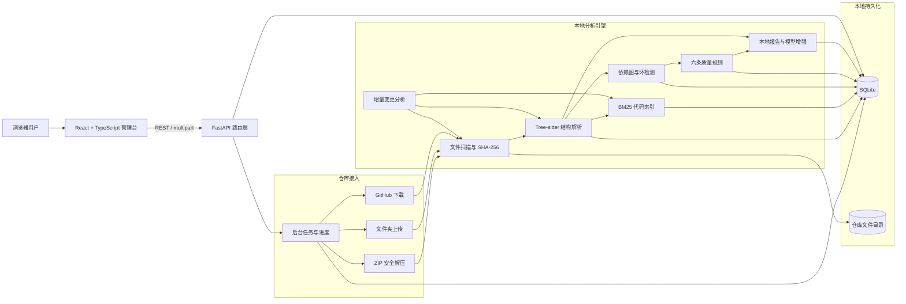
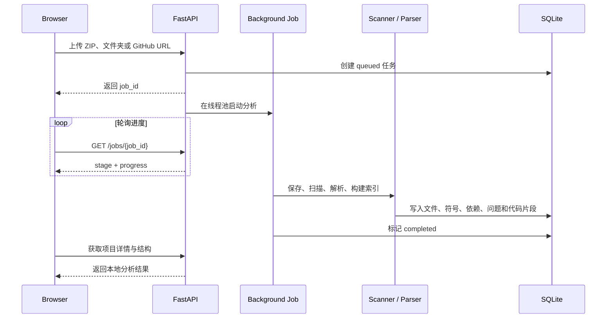

# DevAtlas 系统架构

## 总体架构

可选模型增强通过统一的报告生成接口接入 Ollama 本地模型服务或 OpenAI Responses API。默认本地分析不依赖外部模型；模型服务地址和认证配置保存在根目录 `data/` 中，不进入版本控制。

## 导入与分析时序

## 增量分析策略

1. 先比较文件大小和纳秒级修改时间，快速跳过确定未变化的文件。
2. 元数据变化时计算 SHA-256，区分“时间戳变化”和“内容变化”。
3. 仅对新增和内容变化的源文件执行 Tree-sitter 解析。
4. 删除文件时同步清理符号、导入关系、解析问题和搜索片段。
5. 内容确实变化后刷新导入解析和 BM25 索引；无变化时返回 207 B 左右的轻量摘要。

## 为什么需要数据库

SQLite 用于保存项目、文件元数据、内容哈希、后台任务、符号、导入关系、解析问题和搜索片段，使分析结果可以在重启后继续使用。原始仓库文件仍保存在本地目录中，数据库不承担大文件对象存储。该组合无需额外部署数据库服务，适合个人电脑和简历演示。

## 关键设计取舍

| 设计 | 当前选择 | 原因 |
|---|---|---|
| 数据库 | SQLite | 零运维、可持久化、便于本地演示 |
| 任务系统 | 进程内线程池 + 持久化任务表 | 不引入 Redis/Celery 成本，同时保留阶段进度 |
| 语法解析 | Tree-sitter | 跨语言、速度快、不执行仓库代码 |
| 搜索 | BM25 | 完全本地、结果可解释、无需向量 API |
| 报告 | 本地规则默认 + 可选模型增强 | 无配置即可使用，同时为本地或在线模型预留扩展点 |
| 增量检测 | 元数据快路径 + SHA-256 | 兼顾速度与内容正确性 |
| 原始代码 | 本地文件系统 | 避免将完整仓库存入关系数据库 |
